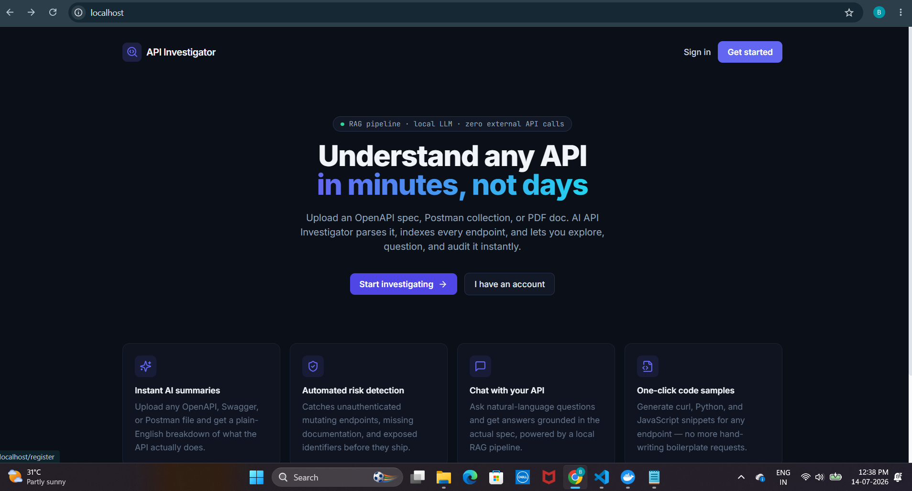
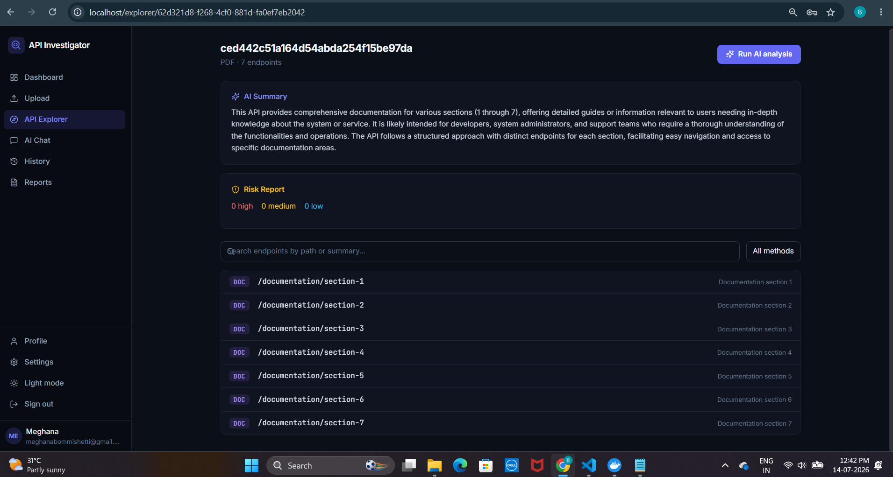
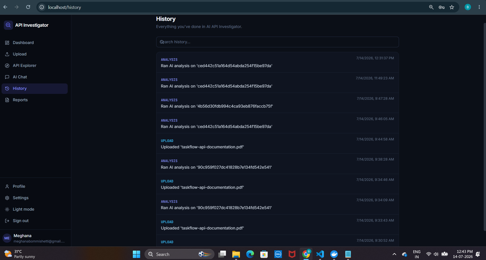
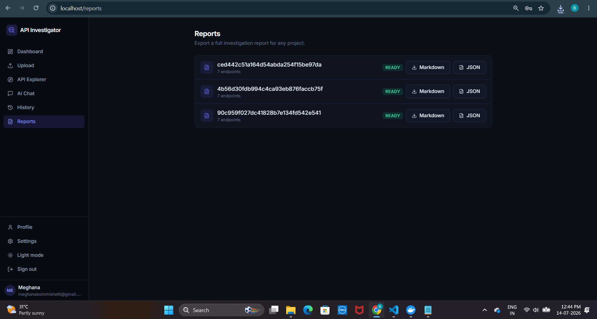

# AI API Investigator

<p align="center">
  
</p>

<p align="center">
  
  
  
  
  
  
  
  
</p>

**AI API Investigator** is a full-stack tool that parses OpenAPI/Swagger specs, Postman collections, and API documentation (PDF/Markdown), then uses a real RAG (Retrieval-Augmented Generation) pipeline to explain endpoints, detect security risks, generate code samples, and answer natural-language questions about the API.

The LLM backend is swappable between a fully self-hosted, zero-API-key setup (Ollama) and a free hosted API (Groq) — see [Tech Stack](#tech-stack) and [Deployment](#deployment).

> Built as a portfolio-grade demonstration of a clean modular-monolith architecture: FastAPI + PostgreSQL on the backend, React + TypeScript on the frontend, a real RAG pipeline (ChromaDB + Sentence Transformers) for AI features, a fully tested codebase (backend + frontend), and two working deployment paths — local Docker Compose and a free-tier cloud stack.

**🔗 Live demo:** _add your deployed Vercel URL here once live — see [DEPLOYMENT.md](DEPLOYMENT.md)_
**🔑 Demo login:** `demo@apiinvestigator.dev` / `DemoPass123!`

---

## Table of Contents

- [Overview](#overview)
- [Screenshots](#screenshots)
- [Architecture](#architecture)
- [Features](#features)
- [Tech Stack](#tech-stack)
- [Getting Started](#getting-started)
  - [Docker Setup (local)](#docker-setup-local)
  - [Running Locally (without Docker)](#running-locally-without-docker)
- [Environment Variables](#environment-variables)
- [Database Migrations & Seed Data](#database-migrations--seed-data)
- [API Documentation](#api-documentation)
- [Testing](#testing)
- [Deployment](#deployment)
- [Folder Structure](#folder-structure)
- [Design Decisions](#design-decisions)
- [Future Improvements](#future-improvements)
- [License](#license)

---

## Overview

Developers integrating with a new API usually start by reading a spec file cover to cover. AI API Investigator turns that spec into an interactive, queryable knowledge base:

1. **Upload** an OpenAPI/Swagger file, a Postman collection, or a PDF/Markdown doc.
2. The backend **parses** it into a normalized list of endpoints and **indexes** each one into a vector store.
3. Run **AI analysis** to get a plain-English summary and an automated security/documentation risk report.
4. Browse the **API Explorer**, click into any endpoint for an AI explanation and ready-to-use `curl` / Python / JavaScript snippets.
5. Open the **AI Chat** and ask questions like *"which endpoints don't require authentication?"* — answered using retrieval-augmented generation grounded in the actual spec, not hallucination.
6. **Export** a full Markdown or JSON report to share with your team.

## Screenshots

| | |
|---|---|
|  **Dashboard** — all investigated APIs at a glance |  **API Explorer** — AI summary, risk report, endpoint list |
|  **History** — Complete history is stored |  **Reports** — one-click Markdown/JSON export |

## Architecture

A clean **modular monolith** — one deployable backend service organized into clear layers, and one frontend SPA. No microservices, no message queues, no Kubernetes: just the right amount of structure for a project this size, while staying easy to explain in an interview.

```
 React SPA (Vite + TS + Tailwind)
        │  HTTP (JWT bearer auth)
        ▼
 FastAPI  ── api/v1 routers (auth, users, projects, chat, search, history, export) — thin, HTTP-only
        │
        ▼
 services/ ── business logic: parsing, embeddings, vector search, RAG, analysis, export, caching
        │
   ┌────┼─────────────────┬────────────────────┬───────────────────┐
   ▼    ▼                 ▼                    ▼                   ▼
PostgreSQL   ChromaDB (vectors,        Redis (AI result       LLM_PROVIDER switch:
(relational  via Sentence              caching + rate         Ollama (local, free)
data + audit) Transformers)            limiting)               or Groq (hosted, free tier)
```

**Why this shape:**
- **Routers stay thin.** `app/api/v1/*.py` only handles HTTP concerns (auth, validation, status codes) and delegates all real logic to `app/services/*.py`. This keeps endpoints testable and easy to read top-to-bottom.
- **AI dependencies are lazily imported.** `sentence-transformers` and `chromadb` are only imported inside the functions that use them, not at module load time. This means the API server, auth, parsing, and risk-detection logic all work and are fully testable even in environments where the heavy ML libraries aren't installed yet — a real production concern, not just a testing trick.
- **Rule-based risk detection always works**, with AI-generated summaries layered on top when the configured LLM is reachable, and a clear fallback message when it isn't. The app never silently pretends the AI ran when it didn't.
- **The LLM backend is a swap, not a rewrite.** `llm_service.py` is the *only* file that knows whether requests go to a local Ollama server or Groq's hosted API — everything above it (RAG, caching, risk detection) is provider-agnostic. Controlled by one env var: `LLM_PROVIDER`.
- **AI results are cached in Redis**, keyed by a content hash of the exact input (not the project ID) — so re-running analysis on an unchanged project is instant, and any real change to the underlying spec automatically produces a fresh cache key without any manual invalidation logic.

## Features

**Core**
- Email/password auth with JWT access + refresh tokens, bcrypt password hashing, role-based (`user`/`admin`) authorization
- Upload OpenAPI/Swagger (JSON or YAML), Postman v2 collections, PDF, or Markdown documentation
- Automatic parsing into normalized endpoints (method, path, params, request/response bodies, tags, auth requirements)
- Pagination, filtering (by HTTP method), and free-text search across projects and endpoints
- Full audit history of every upload, analysis, chat, export, and comparison

**AI (RAG pipeline)**
- Endpoint embeddings via Sentence Transformers, stored per-project in ChromaDB
- Semantic search across a project's endpoints in natural language
- RAG-grounded chat: answers are built from retrieved endpoint context, not free-form generation, with conversation memory per session
- Streaming AI chat responses (token-by-token)
- AI-generated project summaries and per-endpoint explanations, transparently cached in Redis
- Rule-based + AI-assisted risk detection (unauthenticated mutations, missing docs, exposed identifiers)
- One-click `curl` / Python (`requests`) / JavaScript (`fetch`) code generation for any endpoint
- API-to-API comparison (diff of endpoints between two uploaded specs)
- Swappable LLM backend: self-hosted Ollama (free, fully local) or Groq (free tier, hosted, fast)

**Platform**
- Redis-backed fixed-window rate limiting (per-IP, 60 req/min by default) and AI-result caching
- Centralized structured logging and global exception handlers
- Dark mode, responsive layout, loading skeletons, toast notifications, empty/error states
- Dockerized end-to-end with a one-command `docker compose up`, plus a documented free-tier cloud deployment path

## Tech Stack

| Layer      | Technology |
|------------|------------|
| Backend    | Python, FastAPI, SQLAlchemy 2.0, Alembic, Pydantic v2 |
| Database   | PostgreSQL (SQLite supported transparently for tests) |
| Cache      | Redis |
| Auth       | JWT (python-jose), bcrypt (passlib) |
| AI / RAG   | Custom RAG pipeline, Sentence Transformers, ChromaDB, Ollama (Qwen 2.5) or Groq (Llama 3.3) |
| Frontend   | React 18, TypeScript, Vite, Tailwind CSS, React Router, TanStack Query, Axios, React Hook Form |
| Testing    | Pytest (backend), Vitest + React Testing Library (frontend) |
| Deployment | Docker, Docker Compose, Nginx, GitHub Actions CI — plus Vercel/Render/Neon/Upstash for free-tier cloud hosting |

## Getting Started

### Docker Setup (local)

**Prerequisites:** Docker and Docker Compose installed.

```bash
git clone <your-fork-url> ai-api-investigator
cd ai-api-investigator

# Copy and adjust environment variables
cp backend/.env.example backend/.env

# Build and start everything: Postgres, Redis, Ollama, backend, frontend
docker compose up --build
```

This starts:
- **Frontend** → http://localhost (Nginx serving the built React app, proxying `/api` to the backend)
- **Backend API** → http://localhost:8000 (docs at `/api/docs`)
- **PostgreSQL** → localhost:5433 (host-side port, to avoid colliding with a local Postgres install)
- **Redis** → localhost:6379
- **Ollama** → localhost:11434

Ollama's model doesn't always pull reliably via the container's auto-start script — the more reliable approach is to pull it explicitly once the stack is up:
```bash
docker compose exec ollama ollama pull qwen2.5:7b
```
This is a one-time ~4.7GB download; the model persists in a Docker volume afterward. CPU-only inference of a 7B model can take 1-3+ minutes per response — if that's too slow for comfortable iteration, either pull a smaller model (`qwen2.5:1.5b`) or switch `LLM_PROVIDER=groq` in `backend/.env` for near-instant hosted responses (see [Deployment](#deployment)).

On first boot, seed a demo account and sample project:
```bash
docker compose exec backend python seed.py
```

> Everything except AI summaries/chat/explanations works immediately regardless of the LLM's status — upload, parsing, endpoint browsing, rule-based risk detection, history, and export all work with zero AI dependency, by design. The UI shows a clear fallback message if the AI service isn't reachable yet.

### Running Locally (without Docker)

**Backend:**

```bash
cd backend
python -m venv venv && source venv/bin/activate
pip install -r requirements.txt

cp .env.example .env
# Edit .env: point DATABASE_URL at a local Postgres instance,
# or use sqlite:///./dev.db for a zero-setup option.

alembic upgrade head
python seed.py          # optional demo data
uvicorn app.main:app --reload
```

Backend runs at http://localhost:8000, interactive docs at http://localhost:8000/api/docs.

**Frontend:**

```bash
cd frontend
npm install
npm run dev
```

Frontend runs at http://localhost:5173 and proxies `/api` requests to `localhost:8000` (configured in `vite.config.ts`).

**AI features (optional but recommended):**

Either install Ollama locally (`ollama serve && ollama pull qwen2.5:7b`, `LLM_PROVIDER=ollama`), or get a free API key at [console.groq.com](https://console.groq.com) and set `LLM_PROVIDER=groq` + `GROQ_API_KEY` in your `.env` — no local model download needed.

## Environment Variables

All backend configuration lives in `backend/.env` (see `backend/.env.example` for the full list with defaults):

| Variable | Description |
|---|---|
| `SECRET_KEY` | JWT signing secret — **generate a real one for production**: `openssl rand -hex 32` |
| `DATABASE_URL` | PostgreSQL connection string |
| `REDIS_URL` | Redis connection string |
| `BACKEND_CORS_ORIGINS` | Allowed frontend origins |
| `MAX_UPLOAD_SIZE_MB` | Upload size limit (default 10MB) |
| `EMBEDDING_MODEL` | Sentence Transformers model name |
| `LLM_PROVIDER` | `ollama` (self-hosted) or `groq` (hosted, free tier) |
| `OLLAMA_BASE_URL` / `OLLAMA_MODEL` | Used when `LLM_PROVIDER=ollama` |
| `GROQ_API_KEY` / `GROQ_MODEL` | Used when `LLM_PROVIDER=groq` |
| `AI_REQUEST_TIMEOUT_SECONDS` | Ceiling for AI requests — CPU-only Ollama inference can genuinely take minutes, Groq typically returns in seconds |
| `AI_CACHE_TTL_SECONDS` | How long AI summaries/explanations stay cached in Redis |
| `RATE_LIMIT_PER_MINUTE` | Requests per minute per IP |

The frontend has one build-time variable, `VITE_API_BASE_URL`, used only for split cloud deployments (frontend and backend on different domains) — see [Deployment](#deployment). It's unset by default, which correctly falls back to the same-origin `/api/v1` path used by the local Docker/Nginx setup.

## Database Migrations & Seed Data

Migrations are managed with Alembic:

```bash
# Apply all migrations
alembic upgrade head

# Create a new migration after changing models
alembic revision --autogenerate -m "describe your change"

# Roll back one migration
alembic downgrade -1
```

`seed.py` creates a demo user (`demo@apiinvestigator.dev` / `DemoPass123!`) with a pre-loaded sample "Bookstore API" project, so you can explore every page without uploading a file yourself.

## API Documentation

Once the backend is running, interactive API docs are available at:
- Swagger UI: `http://localhost:8000/api/docs`
- ReDoc: `http://localhost:8000/api/redoc`
- Raw OpenAPI JSON: `http://localhost:8000/api/openapi.json`

(Yes — you can upload AI API Investigator's own OpenAPI spec into AI API Investigator.)

## Testing

**Backend — 30 tests, Pytest, run against SQLite (no external services needed):**
```bash
cd backend
pip install -r requirements.txt
pytest -v
```
Covers authentication flows (register/login/refresh/protected routes), spec parsing (OpenAPI + Postman), rule-based risk detection and code generation, the Redis AI-result caching layer (including fail-open behavior when Redis is unavailable), and the Ollama/Groq provider switch.

**Frontend — 31 tests, Vitest + React Testing Library:**
```bash
cd frontend
npm install
npm test
```
Covers shared UI components (badges, empty states, skeletons), token storage, and form validation/submission flows (login, register) with mocked auth context.

Both suites run automatically in CI on every push — see `.github/workflows/ci.yml`.

## Deployment

Two fully documented paths:

1. **Local, self-hosted** — `docker-compose.yml` at the repo root builds and runs all five services (`db`, `redis`, `ollama`, `backend`, `frontend`) with health checks and persistent volumes for Postgres data, Ollama models, the HuggingFace embedding model cache, uploaded files, and the vector store.

2. **Free-tier cloud** — frontend on Vercel, backend on Render, Postgres on Neon, Redis on Upstash, LLM via Groq. Zero cost, no credit card required anywhere. Fully scripted with `render.yaml` (Render Blueprint) and `frontend/vercel.json`. **Full step-by-step walkthrough: [DEPLOYMENT.md](DEPLOYMENT.md)**.

`.github/workflows/ci.yml` runs backend tests, a lint pass, a frontend type-check + build + test, and finally builds both Docker images on every push/PR to `main`.

## Folder Structure

```
ai-api-investigator/
├── backend/
│   ├── app/
│   │   ├── api/v1/          # Thin HTTP routers (auth, users, projects, chat, search, history, export)
│   │   ├── core/             # Config, DB session, security (JWT/bcrypt), Redis, logging
│   │   ├── middleware/       # Rate limiting, global exception handlers
│   │   ├── models/           # SQLAlchemy ORM models
│   │   ├── schemas/          # Pydantic request/response schemas
│   │   ├── services/         # Business logic: parsing, embeddings, vector store, RAG, analysis, export, caching
│   │   └── main.py           # FastAPI app entrypoint
│   ├── alembic/               # Migrations
│   ├── tests/                 # Pytest suite (30 tests)
│   ├── seed.py
│   ├── requirements.txt
│   └── Dockerfile
├── frontend/
│   ├── src/
│   │   ├── api/               # Axios client + typed API calls
│   │   ├── components/        # Shared UI (AppShell, badges, skeletons, empty states) + tests
│   │   ├── context/            # Auth + theme React contexts
│   │   ├── pages/              # One file per route + tests
│   │   ├── test/                # Vitest setup
│   │   ├── router.tsx
│   │   └── App.tsx
│   ├── nginx.conf
│   ├── vercel.json
│   └── Dockerfile
├── docs/screenshots/           # README screenshots
├── docker-compose.yml
├── render.yaml                 # Render Blueprint (one-click backend deploy)
├── DEPLOYMENT.md                # Free-tier cloud deployment walkthrough
├── .github/workflows/ci.yml
└── README.md
```

## Design Decisions

- **Why a modular monolith instead of microservices?** At this scale, microservices would add deployment and debugging overhead without a corresponding benefit — a single well-layered FastAPI service is faster to build, easier to reason about, and still cleanly separates concerns via the `api/` / `services/` / `models/` split.
- **Why lazy-import the AI libraries?** So the core product (auth, upload, parsing, browsing, rule-based risk detection, history, export) degrades gracefully and stays fully testable even if `chromadb` / `sentence-transformers` aren't available in a given environment — a real production resilience pattern, not just a shortcut.
- **Why support both Ollama and Groq?** Ollama keeps uploaded API specs entirely on infrastructure you control, with zero external API keys — ideal for sensitive specs or offline development. Groq trades that local-only guarantee for dramatically faster responses and zero local compute requirements, which matters a lot on free-tier cloud hosting with no GPU. Making this a one-line env var instead of a hard architectural choice means the same codebase serves both use cases honestly.
- **Why cache AI results by content hash instead of project ID?** A cache keyed on project ID would need explicit invalidation logic every time a project's endpoints change. Hashing the exact prompt inputs means the cache is correct by construction — an unchanged project is always a cache hit, and any real change automatically produces a new key.

## Future Improvements

- Multi-user collaboration on a single project (shared workspaces, comments on endpoints)
- OpenAPI spec diffing across versions of the *same* API over time, not just cross-API comparison
- Webhook/CLI support for CI pipelines to fail a build on newly introduced high-severity risks
- Support for GraphQL schema introspection as an additional source type
- Admin dashboard for usage analytics across all users
- Role-based admin panel that actually exercises the existing `admin` role (currently defined but not yet wired to any admin-only routes)

## License

MIT — see [LICENSE](LICENSE).
